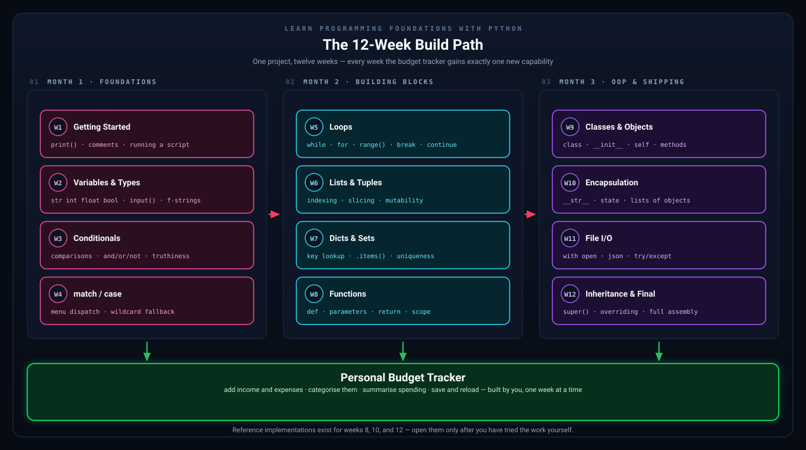

# Learn Programming Foundations with Python

This workspace contains a beginner-focused Python learning plan, weekly chapter notes, teaching support materials, and reference implementations for the Personal Budget Tracker project.



## Start Here

- [python_learning_plan.md](python_learning_plan.md): the main 12-week roadmap
- [chapters](chapters): the weekly lesson content
- [diagrams](diagrams/README.md): every concept diagram, indexed by week
- [python_beginner_glossary.md](python_beginner_glossary.md): quick definitions for beginner terms
- [instructor_guide.md](instructor_guide.md): suggested answers, per-week misconceptions, and teaching notes
- [tests](tests/test_budget_tracker.py): the test suite that keeps the chapters and the code in sync
- [IMPROVEMENTS.md](IMPROVEMENTS.md): prioritized backlog for contributors

## Reference Implementations

Each one is runnable, heavily commented, and tied to the chapters it comes from.

| File | Milestone | Chapters |
|---|---|---|
| [budget_tracker_week8.py](budget_tracker_week8.py) | Functions, tuples, dictionaries | Weeks 6-8 |
| [budget_tracker_week10.py](budget_tracker_week10.py) | Classes and encapsulation | Weeks 9-10 |
| [budget_tracker_final.py](budget_tracker_final.py) | The finished app, with save/load | Weeks 11-12 |

The comments use a small fixed set of symbols so you can skim for one kind of information:

| | Means |
|---|---|
| 📌 | what this block is |
| 🧠 | the idea worth understanding |
| ⚠️ | the trap beginners hit here |
| 🔁 | how the looping works |
| 🧮 | how the numbers and signs work |
| 🧱 | object-oriented mechanics |
| 💾 | saving and loading |

## How Learners Can Use This Repo

1. Read the weekly chapter.
2. Type the examples manually instead of copying them.
3. Complete the project step and `Try It Yourself` prompts.
4. Use the `Ready to Move On?` checklist before starting the next week.
5. Only look at the milestone or final reference implementations after trying the work yourself.

## How Instructors Can Use This Repo

1. Use the weekly chapter as the teaching outline.
2. Use [instructor_guide.md](instructor_guide.md) for recap-question answers and exercise guidance.
3. Compare student work to the milestone implementations when a learner is stuck.
4. Encourage learners to explain their variable names, conditions, loops, and function boundaries out loud.

## Running The Reference Apps

From the repo root, run one of these:

```bash
python3 budget_tracker_week8.py
python3 budget_tracker_week10.py
python3 budget_tracker_final.py
```

On Windows, use `python` (or `py -3`) instead of `python3`.

## Tests

The reference implementations have a test suite. It uses only the standard library, so there is
nothing to install:

```bash
python -m unittest discover tests -v
```

Alongside the usual logic and save/load tests, it extracts the code listings out of the chapters,
runs them, and asserts they behave identically to the reference files. That is what keeps the
written guide and the working code from drifting apart — so if you change one, run the tests and
change the other.

## Diagrams

Every chapter includes one to three diagrams that make the underlying mechanics visible — how a
variable is stored, what happens to a value passed into a function, how a `for` loop is structured.
They live in [diagrams](diagrams/README.md).

The diagrams are generated rather than hand-drawn, so the whole set stays visually consistent. The
generator lives in the hidden `.tooling/` folder — it is repository maintenance, not course
material, and learners never need to open it. Maintainers can rebuild every diagram with:

```bash
python .tooling/generate_diagrams.py
```

See [.tooling/README.md](.tooling/README.md) for details.

## Suggested Learning Flow For The Project

- Weeks 1-5: build the basic interactive tracker
- Weeks 6-8: organize transaction data and refactor with functions
- Weeks 9-10: move to classes and encapsulation
- Weeks 11-12: add persistence, polish, and final project structure

The goal is not to memorize every line. The goal is to understand why each version is structured the way it is.

## Contributors

- [dcodev1702](https://github.com/dcodev1702): project author and maintainer
- GitHub Copilot: AI-assisted drafting, editing, and repository setup support

## License

Released under the [MIT License](LICENSE).