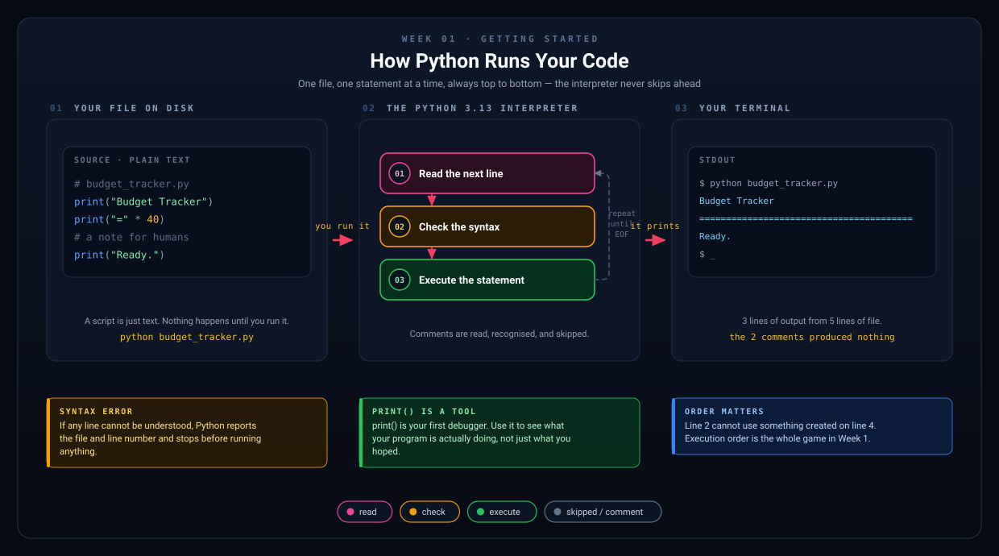
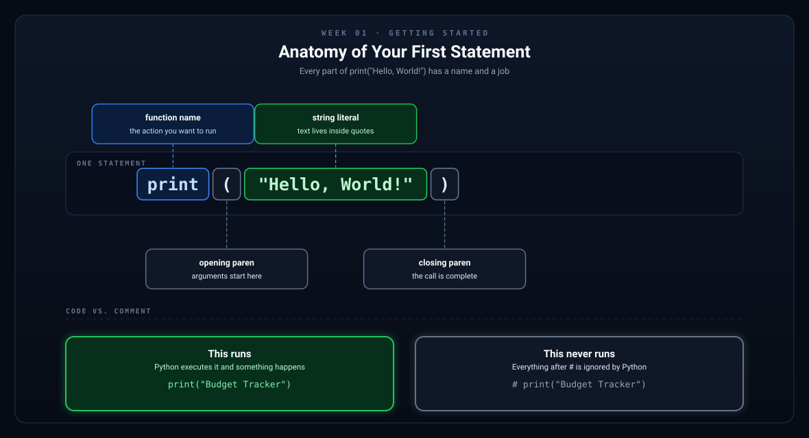

# Week 1 — Getting Started & Your First Program

[Back to Learning Plan](../python_learning_plan.md)

---

## Topics

- What is programming? How does Python work?
- Installing Python 3.13 and setting up VS Code (or your preferred editor)
- Running your first script
- The `print()` function and string basics
- Comments

## Set Up Your Machine

Before you can run anything, you need Python itself and somewhere to type code.

**1. Install Python 3.13**

Download it from [python.org/downloads](https://www.python.org/downloads/).

- On **Windows**, tick **"Add python.exe to PATH"** on the first screen of the installer. This one checkbox saves a lot of trouble later.
- On **macOS**, run the installer and then run the `Install Certificates.command` file it places in your Applications folder.
- On **Linux**, your package manager may already have it. Check the version before installing anything.

**2. Check that it worked**

Open a terminal — PowerShell or Windows Terminal on Windows, Terminal on macOS or Linux — and run:

```bash
python --version
```

You should see something like `Python 3.13.1`. If the command is not found, try `python3 --version`, or on Windows `py --version`.

Whichever one works is the command you will use for the rest of the course. This book writes `python`; substitute `python3` or `py` if that is what your machine responds to.

**3. Install an editor**

[Visual Studio Code](https://code.visualstudio.com/) is free and works everywhere. After installing it, open the Extensions panel and install the official **Python** extension from Microsoft.

Any editor is fine. A word processor is not — code must be saved as plain text.

**4. Run your first file**

Make a folder for this course, create a file called `hello.py` inside it, and put one line in it:

```python
print("Hello, World!")
```

Then, in a terminal opened in that folder, run:

```bash
python hello.py
```

If you see `Hello, World!` printed back, your setup is complete.

In VS Code you can open that terminal with **Terminal → New Terminal**, and it will already be pointed at your folder.

## Concept Guide

Programming is the process of giving a computer a clear set of instructions. If that sounds abstract right now, that is normal. A Python program is just a text file containing those instructions.

When you run a Python file, the Python interpreter reads your code from top to bottom and executes it step by step.



*Nothing in your file happens until you run it. Then the interpreter walks it line by line — reading, checking, executing — and never skips ahead.*

- A **script** is a Python file such as `budget_tracker.py`.
- A **statement** is one instruction, such as `print("Hello")`.
- A **syntax error** means Python could not understand your code.
- A **comment** is a note for humans. Python ignores it.

Comments are useful when they explain *why* something exists, not when they repeat what the code already says.

## Why `print()` Matters

`print()` is your first debugging tool. It lets you see what your program is doing.

- Use it to display messages to the user.
- Use it to check whether a variable contains what you expect.
- Use it to understand the order in which your code runs.



*Every piece of that one line has a name. Learning the names now makes error messages readable later.*

## Examples

```python
# Your very first Python program
print("Hello, World!")

# Printing multiple things
print("My name is Alex.")
print("I am learning Python!")

# Comments explain your code — Python ignores them
# This line won't run, but it helps humans understand your code
```

```python
# Python runs from top to bottom
print("Step 1")
print("Step 2")
print("Step 3")
```

```python
# Comments should add useful context
print("Budget Tracker")

# Good comment: explains intent
print("=" * 40)
```

## Project Step

Create `budget_tracker.py` and print a welcome banner:

```python
# budget_tracker.py — Your Personal Budget Tracker
print("=" * 40)
print("   Welcome to My Budget Tracker!")
print("=" * 40)
print("Track your income and expenses easily.")
```

## Try It Yourself

1. Change the banner text so it uses your own name.
2. Add a line that prints today's goal, such as `Add your first transaction`.
3. Add one comment explaining why the banner is helpful for the user.

## What to Notice

- Each `print()` call does one small job.
- Strings are wrapped in quotes.
- Your program is already becoming an interface for the user.
- Small programs are easier to understand than one big block of code.

## Common Mistakes

- Forgetting quotes around text, which causes Python to treat the text like a variable name.
- Changing indentation randomly. Even simple programs should be kept neat.
- Expecting comments to run. Comments are ignored by Python.
- Feeling like the program is too small to matter. These first steps are the base for everything that follows.
- Saving the file with the wrong extension. It must end in `.py`, not `.py.txt`.
- Running `python` from the wrong folder. If you get `can't open file`, you are not where your file is — `cd` into that folder first.

## Recap Questions

1. What does `print()` do?
2. What is the difference between code and a comment?
3. What does it mean that Python runs code from top to bottom?
4. Which command runs a Python file on your machine: `python`, `python3`, or `py`?

## Ready to Move On?

- I have Python 3.13 installed and I know which command runs it.
- I can create and run a simple Python file.
- I can use `print()` to show output.
- I understand that comments are for humans, not Python.
- I can explain the order in which Python reads simple code.

---

**Next:** [Week 2 — Variables & Data Types](week-02-variables-and-data-types.md)
