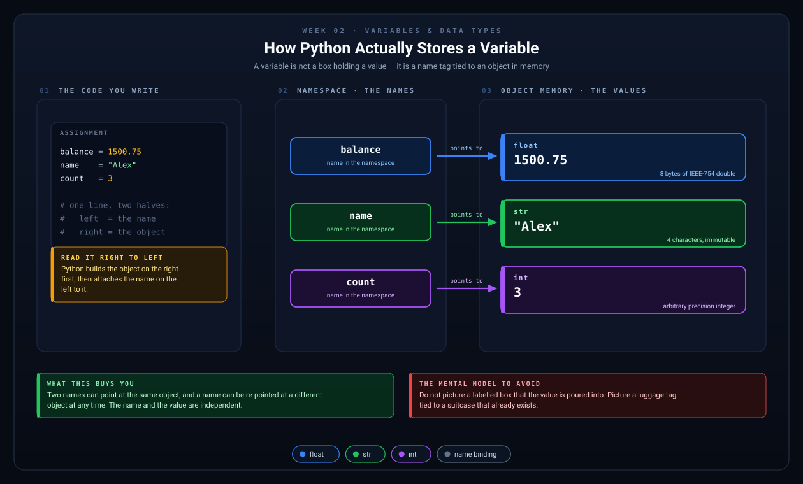
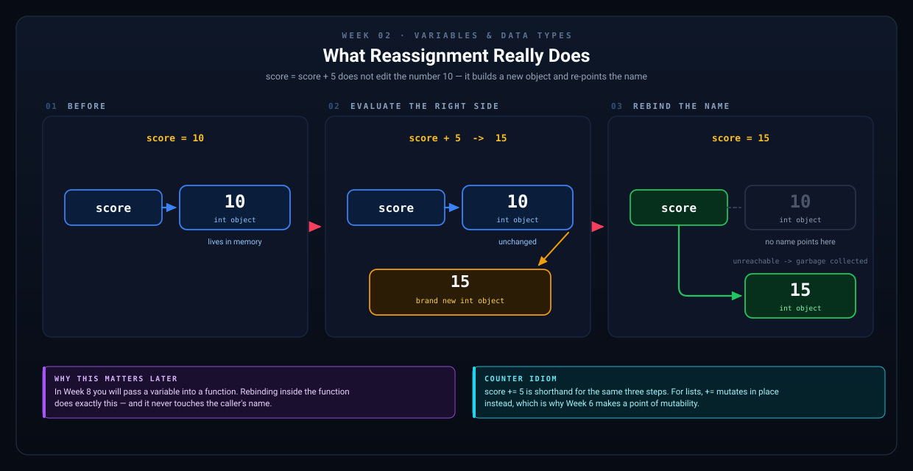
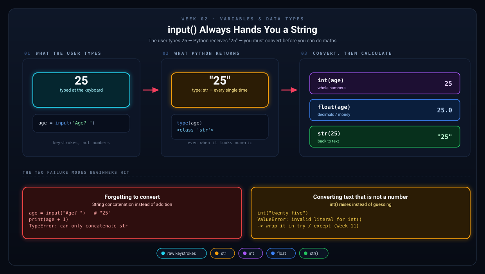

# Week 2 — Variables & Data Types

[Back to Learning Plan](../python_learning_plan.md)

---

## Topics

- Variables: naming, assigning, and reassigning
- Data types: `str`, `int`, `float`, `bool`
- Getting user input with `input()`
- Type conversion: `int()`, `float()`, `str()`
- Basic arithmetic operators (`+`, `-`, `*`, `/`, `//`, `%`, `**`)
- f-strings for formatting output

## Concept Guide

A variable is a name that refers to a value. If this feels simple, that is a good sign. Variables are one of the most important ideas in programming.

```python
age = 25
```

In that example, `age` is the variable name and `25` is the value.

Variables let you store data, reuse it later, and update it as your program runs.



*A variable is not a box that holds a value. It is a name tag tied to an object that already exists in memory. This one picture explains almost everything that confuses beginners about variables, functions, and lists later on.*

```python
score = 10
score = score + 5
print(score)   # 15
```

This is called **reassignment**. The variable name stays the same, but the value changes.



*`score = score + 5` never edits the number `10`. Python builds a new `15`, re-points the name, and the old object is thrown away.*

## Data Types in Plain English

- `str`: text, such as `"hello"`
- `int`: whole numbers, such as `5`
- `float`: decimal numbers, such as `19.99`
- `bool`: `True` or `False`

The type matters because it affects what operations are allowed.

```python
age = 20
price = 9.99
name = "Jordan"
is_logged_in = False
```

## Variable Names: What Is Allowed?

Python variable names:

- can use letters, numbers, and underscores
- cannot start with a number
- cannot contain spaces
- cannot contain symbols like `-`, `@`, or `!`
- cannot use Python keywords

Valid names:

```python
age = 25
user_name = "Alex"
monthly_budget2 = 500
total_income = 1200.50
```

Invalid names:

```python
# 2name = "Alex"        # starts with a number
# user-name = "Alex"    # hyphen is not allowed
# class = "Math"        # keyword
# total income = 100     # spaces are not allowed
```

## What Are Keywords?

Keywords are reserved words that Python already uses for its own syntax. You cannot use them as variable, function, or class names.

Examples of keywords include `if`, `else`, `for`, `while`, `class`, `def`, `return`, `True`, `False`, and `None`.

You do not need to memorize every keyword at once. Just know that if Python uses a word to define the language, you should not use it as a name.

## Good Naming Habits

- Variables should usually be **clear nouns**: `balance`, `user_name`, `tax_rate`
- Function names should usually be **verbs or action phrases**: `calculate_total()`, `save_file()`
- Class names should usually be **PascalCase nouns**: `BudgetTracker`, `BankAccount`
- Constants are often written in **UPPER_CASE**: `TAX_RATE = 0.08`

Better names make code easier to read:

```python
amount = 50
monthly_expense_total = 50
```

Both are valid, but the second name tells the reader more.

## Getting Input and Converting It

`input()` hands back a string every single time, even when the user types digits. Convert before you calculate.



*The two failure modes at the bottom of that diagram are the most common Week 2 errors. Read them once now and you will recognise them instantly later.*

## Examples

```python
# Variables store data for later use
name = "Alex"
age = 25
balance = 1500.75
is_student = True

# Getting input from the user
user_name = input("What is your name? ")
print(f"Nice to meet you, {user_name}!")

# Type conversion — input() always returns a string
age_str = input("How old are you? ")
age = int(age_str)  # Convert string to integer
print(f"Next year you'll be {age + 1}!")

# Basic math
price = 49.99
tax_rate = 0.08
total = price + (price * tax_rate)
print(f"Total with tax: ${total:.2f}")
```

```python
# input() returns text, even when the user types digits
favorite_number = input("Enter your favorite number: ")
print(type(favorite_number))   # <class 'str'>

# Convert before doing math
favorite_number = int(favorite_number)
print(favorite_number + 1)
```

```python
# f-strings let you place variables inside text
item = "coffee"
price = 3.5
print(f"The {item} costs ${price:.2f}")
```

## Project Step

Add variables to track a running balance and let the user input a transaction:

```python
print("=" * 40)
print("   Welcome to My Budget Tracker!")
print("=" * 40)

balance = 0.0

description = input("Enter a transaction description: ")
amount = float(input("Enter the amount (use negative for expenses): "))

balance += amount
print(f"\nTransaction: {description} -> ${amount:.2f}")
print(f"Current balance: ${balance:.2f}")
```

## Try It Yourself

1. Add a `category` variable and store a category name such as `Food` or `Income`.
2. Create three valid variable names for parts of a budget tracker and one invalid name, then explain why it is invalid.
3. Ask the user for two numbers and print their sum using an f-string.

## What to Notice

- `balance` starts with a value of `0.0` because money often uses decimals.
- `description` is text, so it stays a string.
- `amount` must be converted to `float` before you can do math with it.
- Clear names make the program easier to extend later.

## Common Mistakes

- Using vague names like `x` or `thing` when a clearer name would help.
- Forgetting that `input()` returns a string.
- Trying to start a variable name with a number.
- Using a Python keyword, such as `class` or `if`, as a variable name.

## Recap Questions

1. What is a variable?
2. Why does `input()` often need type conversion?
3. What makes a variable name valid in Python?
4. What makes a variable name good, not just valid?

## Ready to Move On?

- I can create variables and change their values.
- I can tell the difference between `str`, `int`, `float`, and `bool`.
- I know why `input()` often needs conversion before math.
- I can choose clear variable names and avoid keywords.

---

**Previous:** [Week 1 — Getting Started](week-01-getting-started.md)
**Next:** [Week 3 — Making Decisions](week-03-if-elif-else.md)
