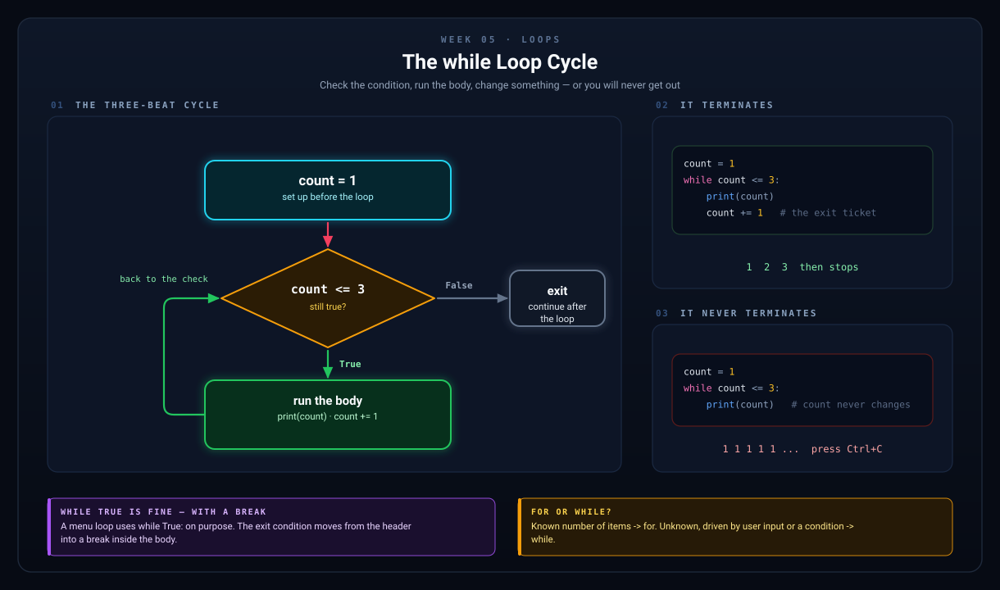
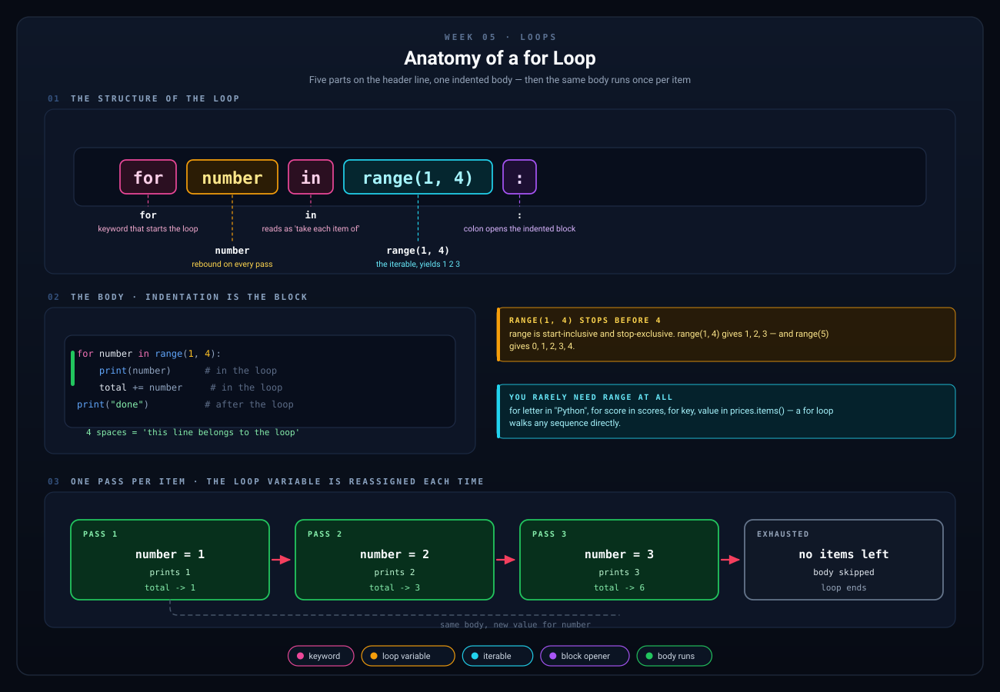
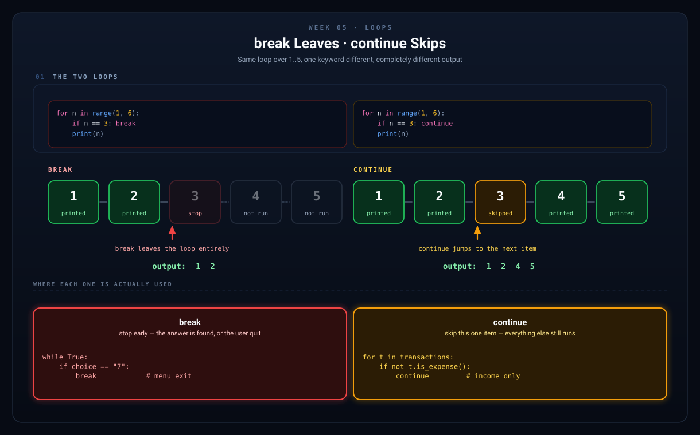

# Week 5 — Loops (`while` and `for`)

[Back to Learning Plan](../python_learning_plan.md)

---

## Topics

- `while` loops and loop conditions
- `for` loops and the `range()` function
- `break` and `continue`
- Avoiding infinite loops
- Looping through strings

## Concept Guide

A loop repeats code. Once you understand loops, your programs can keep working without you writing the same lines again and again.

Without loops, you would have to write the same instructions again and again.

```python
print("Welcome")
print("Welcome")
print("Welcome")
```

A loop lets you express repetition directly.

## `while` Loops

A `while` loop keeps running **as long as** its condition stays true.

```python
count = 1

while count <= 3:
    print(count)
    count += 1
```

This loop stops because `count` changes each time. If the condition never becomes false, you create an **infinite loop**.



*Three beats: check, run, change. Drop the third beat and the loop never ends.*

## `for` Loops

A `for` loop is used when you want to go through a sequence, such as:

- a range of numbers
- a string
- a list
- a tuple

```python
for number in range(3):
    print(number)
```

Read that as: "For each number in this range, run the indented block."



*Take this one slowly. The top half names every part of the header line. The bottom half shows the same body running three times, with `number` rebound to a new value on each pass, until the iterable runs out.*

## `break` and `continue`

- `break` stops the loop immediately
- `continue` skips the rest of the current iteration and moves to the next one



*`break` leaves the loop. `continue` only skips the current item. Mixing them up is one of the most common Week 5 bugs.*

## Examples

```python
# while loop — runs until the condition is False
count = 1
while count <= 5:
    print(f"Count: {count}")
    count += 1

# for loop with range
for i in range(5):       # 0, 1, 2, 3, 4
    print(f"Iteration {i}")

for i in range(1, 11):   # 1 through 10
    print(f"{i} x 7 = {i * 7}")

# break and continue
while True:
    password = input("Enter password: ")
    if password == "python123":
        print("Access granted!")
        break  # Exit the loop
    print("Wrong password. Try again.")

# Looping through a string
word = "Python"
for letter in word:
    print(letter, end=" ")  # P y t h o n
```

```python
# continue skips one round of the loop
for number in range(1, 6):
    if number == 3:
        continue
    print(number)
```

```python
# A while loop is useful when you do not know the exact number of repetitions
answer = ""
while answer != "yes":
    answer = input("Type yes to continue: ").lower()
```

## Project Step

Take your Week 4 menu and wrap it in a loop so the budget tracker keeps running until the user chooses to quit:

```python
balance = 0.0

print("=" * 40)
print("   Welcome to My Budget Tracker!")
print("=" * 40)

while True:
    print("\n--- Menu ---")
    print("1. Add Income")
    print("2. Add Expense")
    print("3. View Balance")
    print("4. Quit")

    choice = input("\nSelect an option: ")

    match choice:
        case "1":
            amount = float(input("Income amount: $"))
            balance += amount
            print(f"Added ${amount:.2f}. Balance: ${balance:.2f}")
        case "2":
            amount = float(input("Expense amount: $"))
            balance -= amount
            print(f"Spent ${amount:.2f}. Balance: ${balance:.2f}")
        case "3":
            print(f"\nYour current balance: ${balance:.2f}")
        case "4":
            print("Thanks for using Budget Tracker. Goodbye!")
            break
        case _:
            print("Invalid choice. Try again.")
```

## Try It Yourself

1. Add a counter that tells the user how many menu actions they have completed.
2. Create a small `for` loop that prints the numbers `1` through `10` and labels even numbers.
3. Build a password loop that keeps asking until the correct password is entered.

## What to Notice

- The menu repeats because of `while True:`.
- `break` is what finally ends the program loop.
- Repetition is what makes a menu-driven app possible.
- Loops and conditionals are often used together.

## Common Mistakes

- Forgetting to update the variable inside a `while` loop, which can create an infinite loop.
- Using `break` too early and ending the loop sooner than intended.
- Confusing `break` with `continue`.
- Expecting `range(5)` to produce `1` through `5` instead of `0` through `4`.

## Recap Questions

1. What is the difference between a `while` loop and a `for` loop?
2. What does `break` do?
3. What does `continue` do?
4. Why can a menu program use `while True:` safely?

## Ready to Move On?

- I can write a `while` loop that stops correctly.
- I can write a `for` loop with `range()`.
- I know the difference between `break` and `continue`.
- I can use a loop to keep a program running until the user chooses to stop.

---

**Previous:** [Week 4 — Pattern Matching](week-04-match-case.md)
**Next:** [Week 6 — Lists & Tuples](week-06-lists-and-tuples.md)
