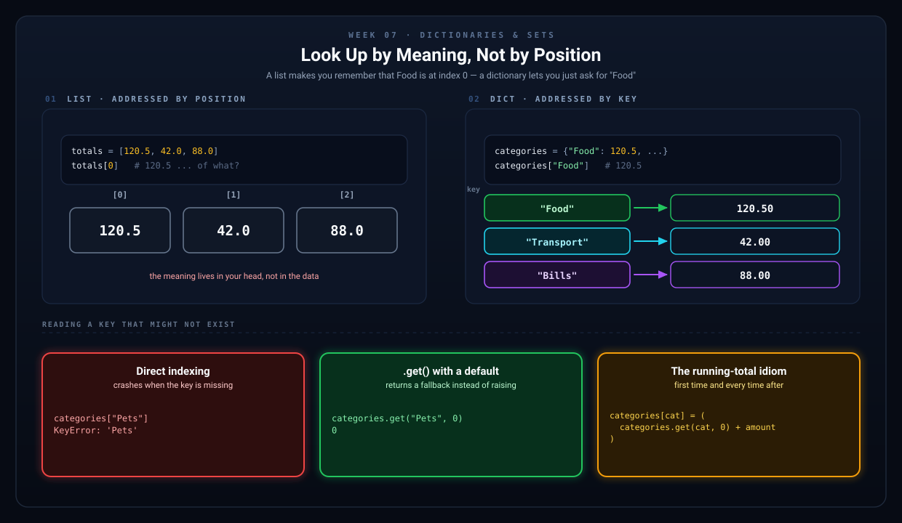
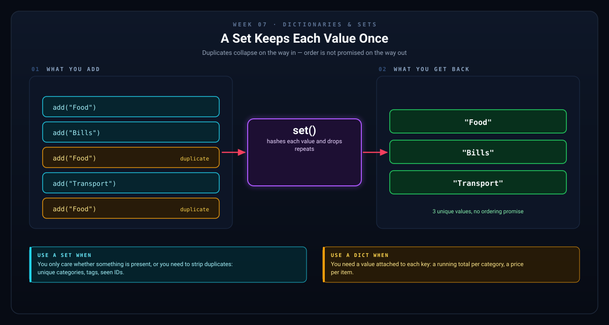

# Week 7 — Dictionaries & Sets

[Back to Learning Plan](../python_learning_plan.md)

[Reference implementation: budget_tracker_week8.py](../budget_tracker_week8.py) — the Week 8 milestone this chapter builds toward.

---

## Topics

- Creating and accessing dictionaries
- Adding, updating, and removing key-value pairs
- Looping through dictionaries (`.keys()`, `.values()`, `.items()`)
- Nested dictionaries
- Sets: unique collections, basic set operations

## Concept Guide

A dictionary stores data as **key-value pairs**. This is often the moment beginners realize they do not have to force everything into lists.

```python
student = {
    "name": "Alex",
    "age": 22
}
```

Here, `"name"` and `"age"` are keys. They help you look up values by meaning rather than position.

Lists are good when order matters. Dictionaries are good when labels matter.

## Why Dictionaries Matter

Imagine storing category totals.

```python
categories = {
    "Food": 120.50,
    "Transport": 42.00
}
```

Now you can ask for `categories["Food"]` directly. That is more expressive than remembering that food is stored at position `0` in a list.



*With a list, the meaning lives in your head. With a dictionary, the meaning lives in the data.*

## Adding to a Running Total

Keeping a total per category has an awkward first step: the very first time you see `"Food"`, there is nothing to add to yet.

The obvious version spells that out:

```python
if category in categories:
    categories[category] = categories[category] + amount
else:
    categories[category] = amount
```

`.get()` collapses both branches into one line by supplying a fallback value when the key is missing:

```python
categories[category] = categories.get(category, 0) + amount
```

Read it as: "take the current total, or `0` if there isn't one yet, add the amount, and store it back."

Both are correct. The second is the version you will see in real Python code, so it is the one this chapter uses.

## Sets in Plain English

A set stores unique values only.

```python
tags = {"python", "coding", "python"}
print(tags)
```

The duplicate `"python"` is removed automatically.

Sets are useful when you care about uniqueness, not order.



*Duplicates collapse on the way in. Nothing promises you an order on the way out — reach for a set when you care about "is it there?", not "which one is first?".*

## Examples

```python
# Dictionaries — key-value pairs
student = {
    "name": "Alex",
    "age": 22,
    "major": "Computer Science"
}

print(student["name"])           # "Alex"
student["gpa"] = 3.8             # Add a new key
student["age"] = 23              # Update a value
del student["major"]             # Remove a key

# Safely get a value (no error if key missing)
email = student.get("email", "Not provided")

# Looping through a dictionary
prices = {"apple": 1.20, "banana": 0.50, "cherry": 2.00}

for item, price in prices.items():
    print(f"{item}: ${price:.2f}")

# Sets — unique items only
tags = {"python", "coding", "python", "beginner"}
print(tags)  # {"python", "coding", "beginner"} — no duplicate
```

```python
# Checking whether a key exists
inventory = {"pens": 10, "notebooks": 4}

if "pens" in inventory:
    print("Pens are tracked.")
```

```python
# Sets are useful for collecting unique categories
categories_used = set()
categories_used.add("Food")
categories_used.add("Bills")
categories_used.add("Food")
print(categories_used)
```

## Project Step

Build on your Week 6 tracker by adding a dictionary that keeps a running total for each spending category:

```python
balance = 0.0
transactions = []
categories = {}  # {"Food": 150.00, "Transport": 45.00, ...}

while True:
    print("\n--- Menu ---")
    print("1. Add Income")
    print("2. Add Expense")
    print("3. View Balance")
    print("4. View Transaction History")
    print("5. View Spending by Category")
    print("6. Quit")

    choice = input("\nSelect an option: ")

    match choice:
        case "1":
            desc = input("Description: ")
            amount = float(input("Amount: $"))
            balance += amount
            transactions.append((desc, amount, "Income"))
        case "2":
            desc = input("Description: ")
            amount = float(input("Amount: $"))
            category = input("Category (e.g., Food, Transport, Bills): ").strip().title() or "Uncategorized"
            balance -= amount
            transactions.append((desc, -amount, category))
            categories[category] = categories.get(category, 0) + amount
        case "3":
            print(f"Current balance: ${balance:.2f}")
        case "4":
            for i, (desc, amt, category) in enumerate(transactions, start=1):
                sign = "+" if amt >= 0 else "-"
                print(f"  {i}. [{category}] {desc}: {sign}${abs(amt):.2f}")
        case "5":
            print("\n--- Spending by Category ---")
            for cat, total in sorted(categories.items()):
                print(f"  {cat}: ${total:.2f}")
        case "6":
            break
        case _:
            print("Invalid choice. Try again.")
```

## Try It Yourself

1. Add a menu option that prints the category with the highest total.
2. Use a set to show all unique categories that have been used.
3. Add a default category such as `Uncategorized` when the user leaves the category blank.

## What to Notice

- `categories` is a dictionary because each total is attached to a category name.
- `categories.get(category, 0)` returns the existing total, or `0` the first time a category is seen, so one line covers both cases.
- Dictionaries make summaries much easier to build.
- Sets are useful later when you want a unique list of category names.

## Common Mistakes

- Trying to access a key that does not exist without using `.get()` or checking first.
- Confusing a dictionary key with a list index.
- Expecting sets to keep items in a reliable order.
- Forgetting that dictionary keys should be meaningful and consistent.
- Skipping `.strip()` on input, which turns `"Food"` and `"Food "` into two separate keys.

## Recap Questions

1. What problem does a dictionary solve better than a list?
2. What is a key-value pair?
3. When is a set useful?
4. Why might `.get()` be safer than direct indexing in some cases?

## Ready to Move On?

- I can store labeled data in a dictionary.
- I can update dictionary totals as new data comes in.
- I understand that sets keep unique values.
- I can explain why category totals fit naturally in a dictionary.

---

**Previous:** [Week 6 — Lists & Tuples](week-06-lists-and-tuples.md)
**Next:** [Week 8 — Functions](week-08-functions.md)
