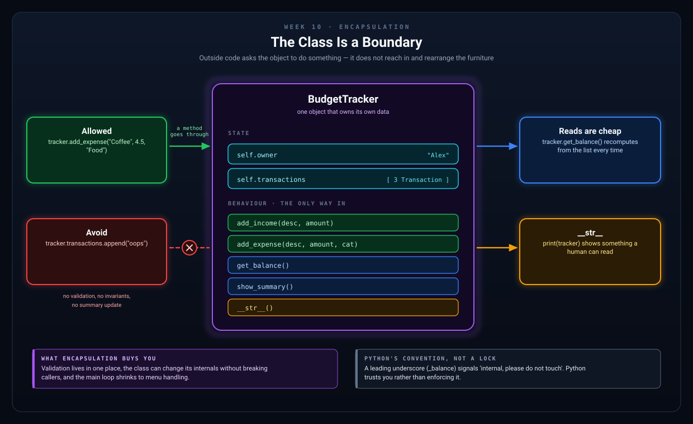
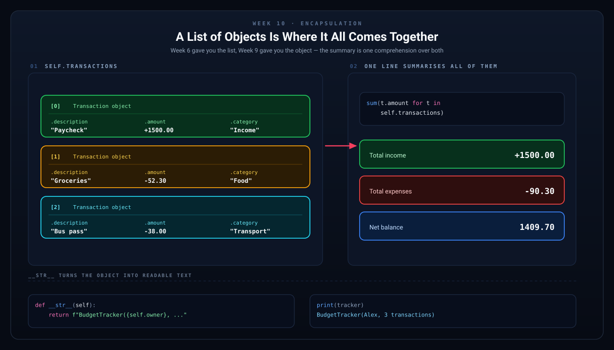

# Week 10 — OOP Continued: Encapsulation & Building a Full Class

[Back to Learning Plan](../python_learning_plan.md)

---

## Topics

- Encapsulation: keeping data and logic together
- The `__str__` and `__repr__` special methods
- Class with methods that manage internal state
- Working with lists of objects

## Concept Guide

Encapsulation means keeping related data and the code that works with that data in the same place. This is one of the big reasons classes are useful in real programs.

For example, a bank account should not be just a balance number floating around your program. It should also know how to deposit, withdraw, and describe itself.

That is why classes often hold both attributes and methods.

## Why Encapsulation Helps

- It reduces duplicated logic.
- It makes your code easier to reason about.
- It gives objects clear responsibilities.

Instead of doing balance math everywhere, you can call methods like `deposit()` and `withdraw()`.



*Outside code asks the object to do something. It does not reach in and rearrange the furniture.*

## Special Methods

Special methods such as `__str__` let you control how an object is shown when printed.

```python
class User:
    def __init__(self, name):
        self.name = name

    def __str__(self):
        return f"User({self.name})"
```

Now `print(user)` can show something meaningful.

## Lists of Objects

Once you create many objects of the same type, you often store them in a list.

```python
transactions = []
transactions.append(Transaction("Paycheck", 1200, "Income"))
transactions.append(Transaction("Groceries", -45, "Food"))
```

This gives you a structured way to manage many related records.



*Week 6 gave you the list. Week 9 gave you the object. Put them together and a whole summary is one line of code.*

## Examples

```python
class BankAccount:
    def __init__(self, owner, balance=0.0):
        self.owner = owner
        self.balance = balance

    def deposit(self, amount):
        if amount <= 0:
            print("Deposit must be positive.")
            return
        self.balance += amount
        print(f"Deposited ${amount:.2f}. New balance: ${self.balance:.2f}")

    def withdraw(self, amount):
        if amount > self.balance:
            print("Insufficient funds!")
            return
        self.balance -= amount
        print(f"Withdrew ${amount:.2f}. New balance: ${self.balance:.2f}")

    def __str__(self):
        return f"Account({self.owner}, balance=${self.balance:.2f})"

account = BankAccount("Alex", 100)
print(account)          # Account(Alex, balance=$100.00)
account.deposit(50)     # Deposited $50.00. New balance: $150.00
account.withdraw(30)    # Withdrew $30.00. New balance: $120.00
```

```python
# Methods protect the object's logic
account = BankAccount("Taylor", 200)
account.deposit(25)
account.withdraw(300)   # Rejected by the method
```

## Project Step

Take the transaction logic from Week 9 and move the program responsibilities into a `BudgetTracker` class so the data and behavior stay together:

```python
class BudgetTracker:
    def __init__(self, owner):
        self.owner = owner
        self.transactions = []

    def add_income(self, description, amount):
        t = Transaction(description, amount, "Income")
        self.transactions.append(t)
        print(f"Income added: +${amount:.2f}")

    def add_expense(self, description, amount, category):
        t = Transaction(description, -amount, category)
        self.transactions.append(t)
        print(f"Expense added: -${amount:.2f} [{category}]")

    def get_balance(self):
        return sum(t.amount for t in self.transactions)

    def show_history(self):
        if not self.transactions:
            print("No transactions yet.")
            return
        for i, transaction in enumerate(self.transactions, start=1):
            transaction.display(i)

    def show_summary(self):
        income = sum(t.amount for t in self.transactions if t.amount > 0)
        expenses = sum(t.amount for t in self.transactions if t.amount < 0)
        print(f"\n--- Summary for {self.owner} ---")
        print(f"  Total Income:   +${income:.2f}")
        print(f"  Total Expenses: -${abs(expenses):.2f}")
        print(f"  Balance:         ${self.get_balance():.2f}")

    def spending_by_category(self):
        categories = {}
        for t in self.transactions:
            if t.is_expense():
                cat = t.category
                categories[cat] = categories.get(cat, 0) + abs(t.amount)
        print("\n--- Spending by Category ---")
        for cat, total in sorted(categories.items()):
            print(f"  {cat}: ${total:.2f}")

    def __str__(self):
        return f"BudgetTracker({self.owner}, {len(self.transactions)} transactions)"

tracker = BudgetTracker("Alex")
tracker.add_income("Paycheck", 1500)
tracker.add_expense("Groceries", 52.30, "Food")
tracker.show_history()
tracker.show_summary()
```

## Try It Yourself

1. Add a method that counts the number of expense transactions.
2. Add a method that prints only transactions from one category.
3. Add a small `main()` function that creates a tracker and calls a few methods.

## What to Notice

- `BudgetTracker` now owns the transaction list.
- Methods like `add_income()` and `show_summary()` give the class clear responsibilities.
- Encapsulation reduces the amount of loose code in your main program.
- This is the point where your app starts to feel like a real software design instead of a collection of separate snippets.

## Common Mistakes

- Letting outside code directly manipulate everything instead of using methods.
- Putting too many unrelated responsibilities into one class.
- Writing methods that are so large they become hard to understand.
- Forgetting that `__str__` should help humans read the object.

## Recap Questions

1. What does encapsulation mean?
2. Why is it useful for a class to manage its own data?
3. What is `__str__` for?
4. Why is a list of objects often better than a list of loose values?

## Ready to Move On?

- I can group related data and behavior inside one class.
- I can write methods that manage an object's internal state.
- I understand why `BudgetTracker` should manage its own transactions.
- I can explain how encapsulation makes programs easier to organize.

---

**Previous:** [Week 9 — Introduction to OOP](week-09-intro-to-oop.md)
**Next:** [Week 11 — File I/O](week-11-file-io.md)
