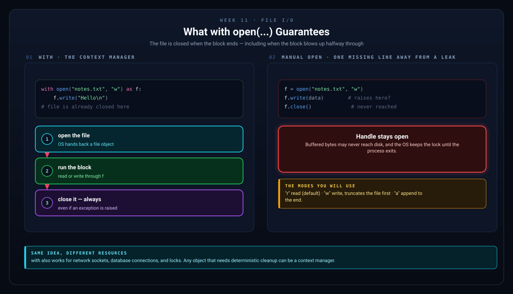
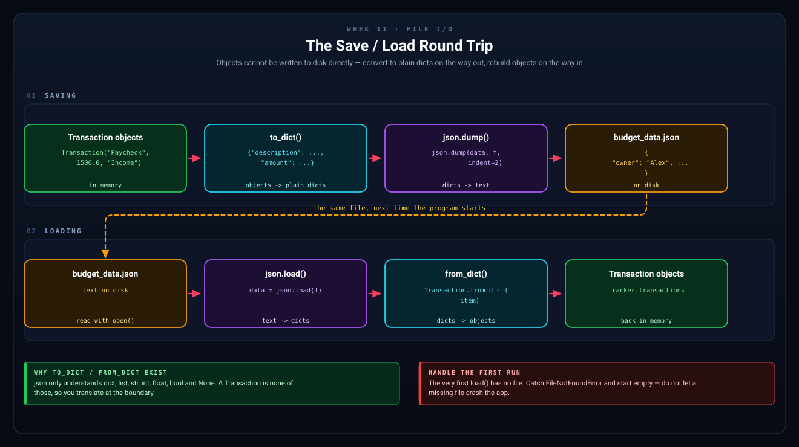
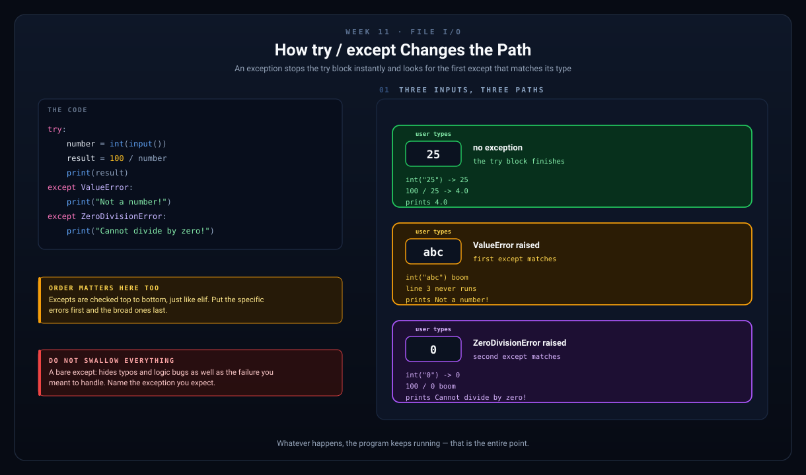

# Week 11 — File I/O: Saving & Loading Data

[Back to Learning Plan](../python_learning_plan.md)

---

## Topics

- Reading from and writing to text files
- The `with` statement (context managers)
- Working with CSV files using the `csv` module
- The `json` module: saving and loading structured data
- Error handling with `try`/`except`

## Concept Guide

Programs become much more useful when they can save data and load it later. This is what turns your tracker from a temporary exercise into something a person could actually use more than once.

Without file I/O, your budget tracker forgets everything as soon as the program ends.

## Why `with open(...)` Is Used

```python
with open("notes.txt", "w") as f:
    f.write("Hello")
```

The `with` statement opens the file and makes sure it is properly closed when you are done.

That is safer than opening a file and forgetting to close it yourself.



*The guarantee is the point: the file gets closed even when the block raises halfway through.*

## Text vs. Structured Data

- Plain text files are good for simple lines of text.
- CSV files are good for flat, table-shaped data that a spreadsheet should open.
- JSON files are good for structured data such as dictionaries and lists.

For a budget app, JSON is a better fit because transactions have multiple pieces of data.



*`json` only understands dicts, lists, strings, numbers, booleans, and `None`. A `Transaction` is none of those, so you translate at the boundary in both directions.*

## CSV: One Row Per Record

CSV stands for **comma-separated values**. It is the format Excel, Numbers, and Google Sheets all understand, so it is what you reach for when a human needs to open your data.

A CSV file is just text. This is the whole thing:

```text
description,amount,category
Paycheck,1500.0,Income
Groceries,-52.3,Food
```

The first line is the **header row** — it names the columns. Every line after it is one record.

Python's `csv` module handles the fiddly parts for you, such as a description that itself contains a comma.

```python
import csv

transactions = [
    {"description": "Paycheck", "amount": 1500.0, "category": "Income"},
    {"description": "Groceries", "amount": -52.30, "category": "Food"},
]

# Writing — newline="" is required on Windows to avoid blank lines
with open("transactions.csv", "w", newline="") as f:
    writer = csv.DictWriter(f, fieldnames=["description", "amount", "category"])
    writer.writeheader()
    writer.writerows(transactions)

# Reading — every value comes back as a string
with open("transactions.csv", "r", newline="") as f:
    for row in csv.DictReader(f):
        print(row["description"], float(row["amount"]))
```

`DictReader` uses the header row to give you a dictionary per line, so you can say `row["amount"]` instead of `row[1]`.

Notice the last line: `float(row["amount"])`. CSV has no idea what a number is — everything you read back is a string, exactly like `input()` in Week 2. JSON does remember types, which is why the budget tracker saves in JSON and only *exports* to CSV.

### Choosing Between Them

| Use | When |
|---|---|
| Plain text | A log, a note, one string per line |
| CSV | Flat rows and columns, and a human will open it in a spreadsheet |
| JSON | Nested data, mixed types, and your program is the only reader |

## Error Handling in Plain English

Sometimes code fails for normal reasons.

- the file does not exist
- the user types invalid input
- data is not in the format you expected

`try` / `except` lets your program handle those problems without crashing immediately.

```python
try:
    number = int(input("Enter a number: "))
except ValueError:
    print("That was not a valid whole number.")
```



*The `except` clauses are checked top to bottom, exactly like `elif`. Name the exception you expect — a bare `except:` hides your own typos alongside the failure you meant to handle.*

## Examples

```python
# Writing to a file
with open("notes.txt", "w") as f:
    f.write("Line 1: Hello!\n")
    f.write("Line 2: Learning Python.\n")

# Reading from a file
with open("notes.txt", "r") as f:
    content = f.read()
    print(content)

# Working with JSON — great for saving structured data
import json

data = {"name": "Alex", "scores": [95, 88, 72]}

# Save to JSON file
with open("data.json", "w") as f:
    json.dump(data, f, indent=2)

# Load from JSON file
with open("data.json", "r") as f:
    loaded = json.load(f)
    print(loaded["name"])  # "Alex"

# Error handling
try:
    number = int(input("Enter a number: "))
    result = 100 / number
    print(f"Result: {result}")
except ValueError:
    print("That's not a valid number!")
except ZeroDivisionError:
    print("You can't divide by zero!")
```

```python
# You can save a list of dictionaries as JSON
transactions = [
    {"description": "Paycheck", "amount": 1200},
    {"description": "Groceries", "amount": -45}
]

with open("transactions.json", "w") as f:
    json.dump(transactions, f, indent=2)
```

## Project Step

Build directly on your Week 10 classes by teaching both `Transaction` and `BudgetTracker` how to save and load data cleanly:

```python
import json

class Transaction:
    def __init__(self, description, amount, category="Income"):
        self.description = description
        self.amount = amount
        self.category = category

    def to_dict(self):
        return {
            "description": self.description,
            "amount": self.amount,
            "category": self.category
        }

    @classmethod
    def from_dict(cls, data):
        return cls(
            data["description"],
            data["amount"],
            data.get("category", "Uncategorized"),
        )

class BudgetTracker:
    # ... (keep the methods from Week 10) ...

    def save(self, filename="budget_data.json"):
        """Save all transactions to a JSON file."""
        data = [t.to_dict() for t in self.transactions]
        with open(filename, "w") as f:
            json.dump({"owner": self.owner, "transactions": data}, f, indent=2)
        print(f"Data saved to {filename}!")

    def load(self, filename="budget_data.json"):
        """Load transactions from a JSON file."""
        try:
            with open(filename, "r") as f:
                data = json.load(f)
            self.owner = data["owner"]
            self.transactions = [
                Transaction.from_dict(item)
                for item in data["transactions"]
            ]
            print(f"Loaded {len(self.transactions)} transactions.")
        except FileNotFoundError:
            print("No saved data found. Starting fresh!")
        except json.JSONDecodeError:
            print(f"{filename} is not valid JSON. Starting fresh!")
        except (KeyError, TypeError):
            print(f"{filename} is missing expected fields. Starting fresh!")
```

## Try It Yourself

1. Add the date to each saved transaction and load it back in. Notice that `from_dict` already survives old files without a date if you use `.get()` for it too.
2. Add an `export_csv()` method that writes the transactions with `csv.DictWriter`, then open the result in a spreadsheet.
3. Corrupt `budget_data.json` on purpose — delete a brace — and confirm your program says something friendly instead of crashing.
4. Change the default filename and test saving twice.

## What to Notice

- Saving and loading are now part of the class behavior.
- JSON matches your data model better than plain text, because it remembers types.
- CSV is the format you export *to*, not the format you work *in* — everything it hands back is a string.
- `try` / `except` turns common failures into manageable situations.
- Good programs do not just work in perfect conditions; they handle mistakes gracefully.

## Common Mistakes

- Forgetting to open the file in the correct mode, such as `"r"` or `"w"`.
- Assuming a file will always exist.
- Catching errors without understanding what might have caused them.
- Using a bare `except:`, which hides your own typos along with the error you meant to handle.
- Forgetting `newline=""` when writing CSV on Windows, which produces a blank line between every row.
- Forgetting that CSV values come back as strings and doing maths on them directly.
- Saving data in a format that does not match how the program needs to use it later.

## Recap Questions

1. Why is `with open(...)` safer than opening a file manually?
2. Why is JSON a better fit than CSV for the budget tracker's own save file?
3. What problem does `try` / `except` solve?
4. What happens if you try to load a file that is missing, and what happens if it exists but is corrupt?
5. Why does `csv.DictReader` give you `"1500.0"` instead of `1500.0`?

## Ready to Move On?

- I can read from and write to files using `with`.
- I understand why JSON fits structured program data, and when CSV is the better choice.
- I can save and load tracker data without changing its meaning.
- I can handle a missing file and a corrupt file without crashing the program.

---

**Previous:** [Week 10 — OOP Continued](week-10-encapsulation.md)
**Next:** [Week 12 — Inheritance & Final Assembly](week-12-inheritance-and-final-project.md)
